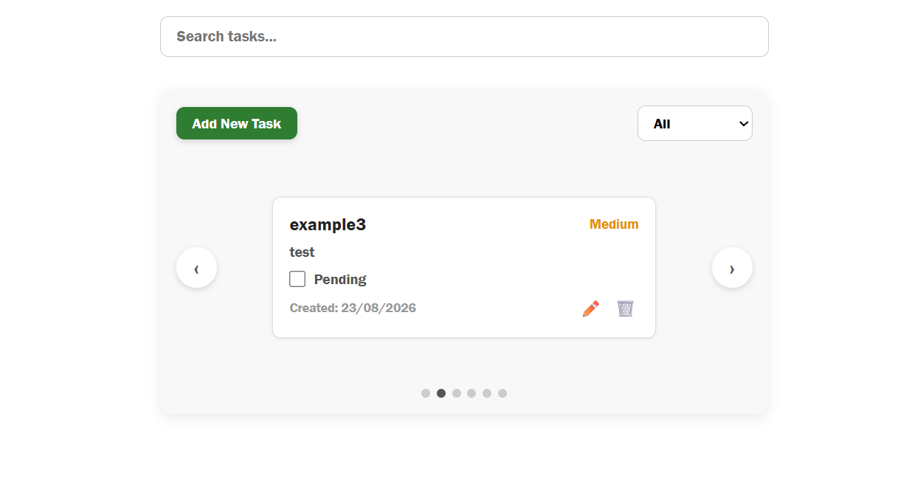
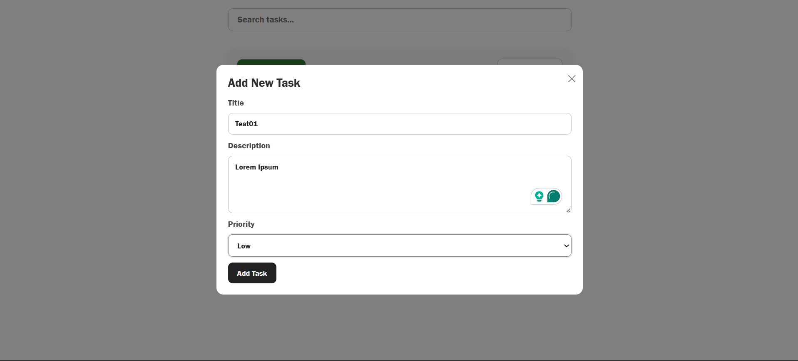
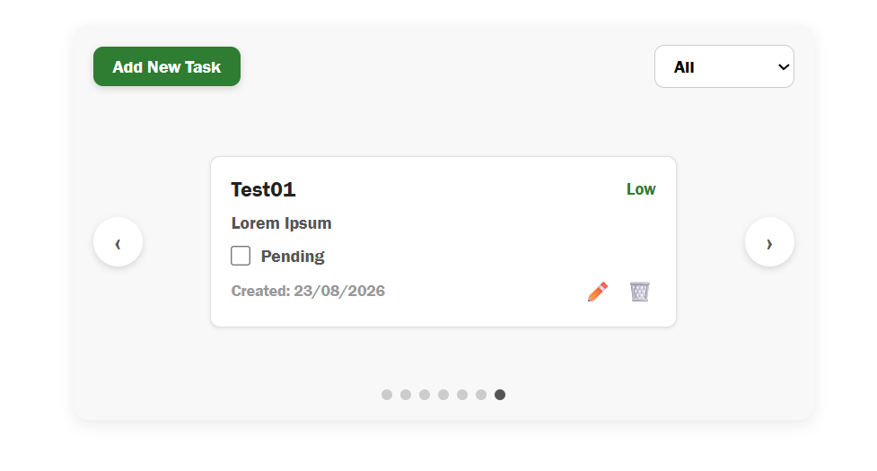
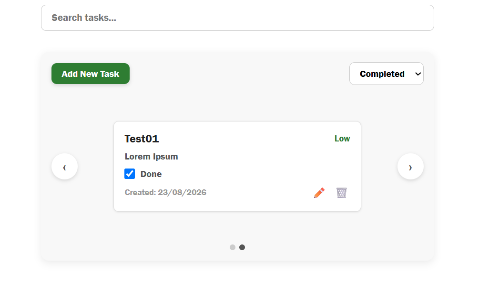

# Task Manager App  
A simple Task Manager app for creating and managing tasks. You can add, edit, delete, filter by task status, and mark tasks as completed, with all tasks displayed in an endless carousel. In addition, there is a search bar that filters tasks by title and description.

## Backend Setup 
1. cd backend 
2. npm install 
3. npm start (runs on port 4000) 

## Frontend 
Setup 1. 
cd frontend 2. 
npm install 3. 
npm start (runs on port 3000) 

## API Endpoints 
- GET /api/tasks 
- POST /api/tasks 
- PUT /api/tasks/:id 
- DELETE /api/tasks/:id 
- PATCH /api/tasks/:id/toggle 

## Assumptions
- Tasks are stored in memory as requested, so the data is cleared whenever the backend server restarts.
- Search and status filtering are handled on the frontend since all tasks are already loaded. For larger amounts of data, I would handle the filtering in the backend and send the required filters as query params from the frontend.

## Spent Time
- Backend - ~1 hour
- Frontend (styling and design) - ~2.5 hours
- Finishes - ~30 minutes

## Screenshots

